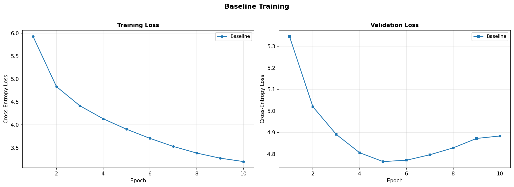
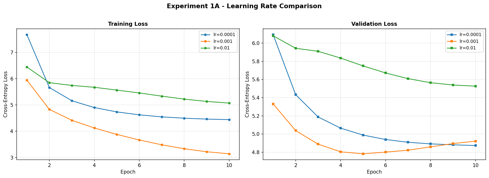
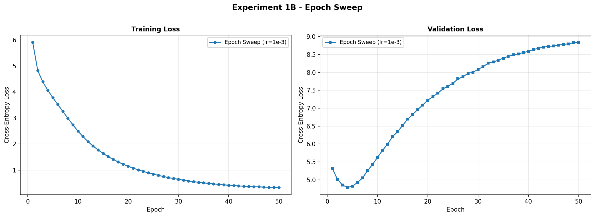
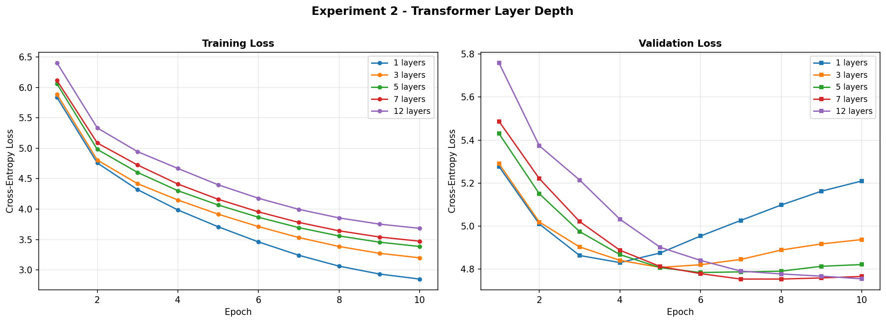
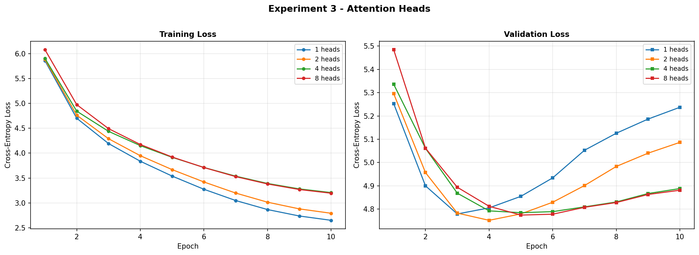
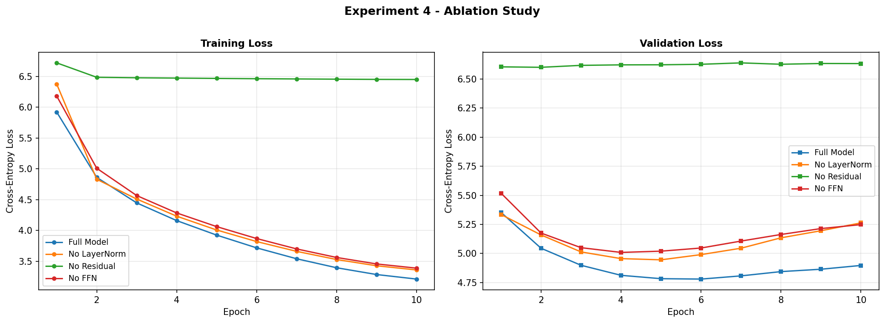
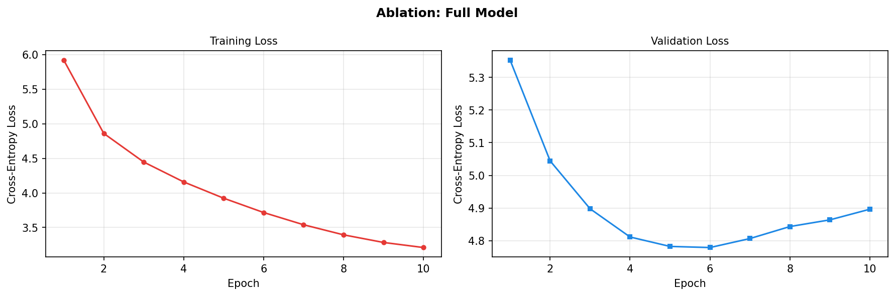
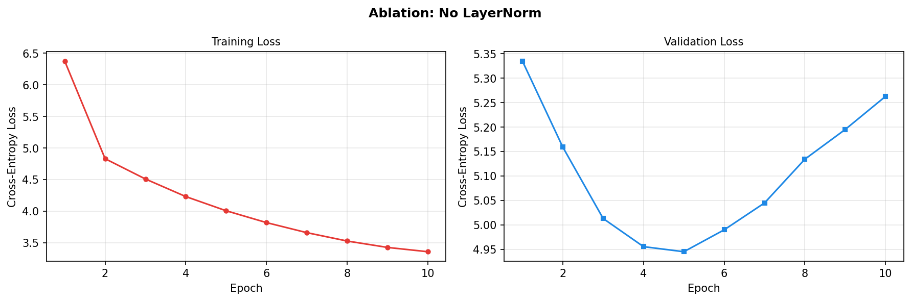
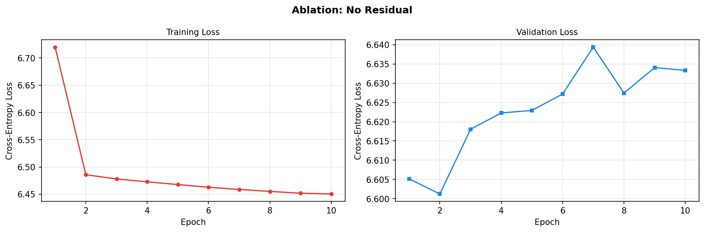
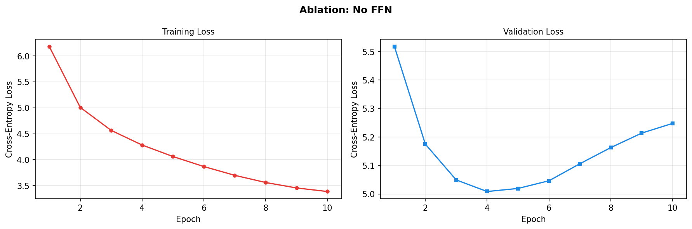

# Building GPT-2 from Scratch

A research-focused implementation of a GPT-style Large Language Model built entirely from scratch in PyTorch, trained on a public-domain text corpus, with systematic experiments studying how architectural choices and hyperparameters affect training dynamics.

---

## Table of Contents

- [Overview](#overview)
- [Project Structure](#project-structure)
- [Model Architecture](#model-architecture)
- [Dataset](#dataset)
- [Baseline Configuration](#baseline-configuration)
- [Experiments](#experiments)
  - [Baseline](#baseline)
  - [Experiment 1A — Learning Rate Comparison](#experiment-1a--learning-rate-comparison)
  - [Experiment 1B — Epoch Sweep](#experiment-1b--epoch-sweep)
  - [Experiment 2 — Transformer Layer Depth](#experiment-2--transformer-layer-depth)
  - [Experiment 3 — Number of Attention Heads](#experiment-3--number-of-attention-heads)
  - [Experiment 4 — Ablation Study](#experiment-4--ablation-study)
- [Results Summary](#results-summary)
- [Setup and Usage](#setup-and-usage)
- [Requirements](#requirements)
- [Hardware Compatibility](#hardware-compatibility)

---

## Overview

This project trains a GPT-style transformer language model from scratch and systematically investigates how architectural and training hyperparameters influence model behaviour. It was built as a research-based assessment ("Vizura LLM from Scratch") and is compatible with TPU (v5e-1 / v2-8 / v3-8), GPU, and CPU backends.

**Objectives:**
- Implement every component of a GPT transformer from scratch (tokeniser, dataset, attention, FFN, residuals, layer norm, training loop).
- Run controlled experiments by varying one hyperparameter at a time.
- Produce structured, reproducible results saved to JSON, CSV, and PNG plots.

---

## Project Structure

```
Building_GPT2/
│
├── LLM.ipynb                              # Main notebook — model definition, training, experiments
│
├── corpus.txt                             # Combined training corpus (3 books, ~1.7M chars)
├── pride_and_prejudice.txt                # Source text 1
├── frankenstein.txt                       # Source text 2
├── sherlock_holmes.txt                    # Source text 3
│
├── experiment_results.json                # All experiment results (structured JSON)
├── experiment_results.csv                 # All experiment results (CSV)
│
├── Baseline_Training.png                  # Baseline loss curves
├── Experiment_1A_-_Learning_Rate_Comparison.png
├── Experiment_1B_-_Epoch_Sweep.png
├── Experiment_2_-_Transformer_Layer_Depth.png
├── Experiment_3_-_Attention_Heads.png
├── Experiment_4_-_Ablation_Study.png
├── Ablation_Full_Model.png
├── Ablation_No_FFN.png
├── Ablation_No_LayerNorm.png
└── Ablation_No_Residual.png
```

---

## Model Architecture

The GPT model is implemented from scratch as a stack of modular classes:

| Component | Description |
|---|---|
| **Token Embedding** | Learnable embedding table mapping vocabulary IDs (GPT-2 BPE, 50 257 tokens) to vectors of size `emb_dim` |
| **Positional Embedding** | Learnable positional encodings added to token embeddings |
| **LayerNorm** | Pre-LN design: normalises activations before each sub-layer. Replaced by `IdentityNorm` in ablation runs |
| **MultiHeadAttention** | Causal (masked) scaled dot-product attention across `n_heads` parallel subspaces. Mask is built from actual sequence length for XLA/TPU compatibility |
| **FeedForward (FFN)** | Two-layer MLP with GELU activation and 4× hidden expansion. Replaced by `IdentityFFN` in ablation runs |
| **TransformerBlock** | Attention + FFN, each preceded by LayerNorm and followed by a residual (skip) connection |
| **GPTModel** | Token embedding → positional embedding → N transformer blocks → final LayerNorm → linear projection to logits (weight-tied with the embedding table) |

**Weight tying:** The output projection matrix shares weights with the token embedding table, reducing parameters by ~13 M and improving generalisation.

**Ablation flags:** Every `TransformerBlock` accepts `use_norm`, `use_residual`, and `use_ffn` booleans, making it trivial to disable any architectural component for ablation experiments.

---

## Dataset

Three public-domain books are downloaded from [Project Gutenberg](https://www.gutenberg.org/) and concatenated into `corpus.txt`:

| Book | Author | Size |
|---|---|---|
| *Pride and Prejudice* | Jane Austen | ~700 KB |
| *Frankenstein* | Mary Shelley | ~430 KB |
| *The Adventures of Sherlock Holmes* | Arthur Conan Doyle | ~580 KB |

**Combined corpus:** ~1.7 million characters / ~420 000 tokens (GPT-2 BPE).

**Data pipeline:**
- **Tokeniser:** `tiktoken` with the GPT-2 BPE vocabulary (50 257 tokens).
- **Train/val split:** 90% / 10% on raw text characters before tokenisation (no leakage).
- **`GPTDataset`:** Sliding-window dataset with configurable `max_length` (context window) and `stride`. Overlapping windows (`stride = max_length / 2`) double the effective sample count.
- **`DataLoader`:** Batched, shuffled training loader; sequential validation loader. `num_workers=0` for TPU compatibility.

---

## Baseline Configuration

| Parameter | Value | Rationale |
|---|---|---|
| `VOCAB_SIZE` | 50 257 | Fixed by GPT-2 BPE tokeniser |
| `CONTEXT_LEN` | 128 | Fast on TPU; sufficient for coherent text |
| `EMB_DIM` | 256 | Small but meaningful embedding space |
| `N_LAYERS` | 4 | Moderate depth |
| `N_HEADS` | 4 | 64 dims per head |
| `DROPOUT` | 0.1 | Light regularisation |
| `BATCH_SIZE` | 32 | Fits TPU/GPU memory |
| `LEARNING_RATE` | 1e-3 | AdamW with cosine annealing |
| `EPOCHS` | 10 | Sufficient for convergence on this corpus |

**Optimiser:** AdamW with cosine annealing LR schedule and gradient clipping at 1.0.

**Baseline model size:** ~28.9 M parameters.

---

## Experiments

### Baseline

Trains the model with the default configuration above. Establishes the reference validation loss for all subsequent experiments.



**Key observations:**
- Initial loss ≈ `ln(50257) ≈ 10.82` (uniform distribution over vocabulary).
- Rapid decrease in the first 2–3 epochs as the model learns basic n-gram statistics.
- Small but expected train/val gap after 10 epochs.

---

### Experiment 1A — Learning Rate Comparison

Tests three learning rates — `1e-4`, `1e-3`, `1e-2` — with all other hyperparameters fixed.



| LR | Behaviour |
|---|---|
| `1e-4` | Slow, stable descent. Fails to fully converge in 10 epochs |
| `1e-3` | "Goldilocks" rate — fast initial descent, smooth convergence |
| `1e-2` | Oscillation or divergence — gradient steps overshoot the loss bowl |

**Key insight:** AdamW with cosine annealing is most effective at `1e-3` for this architecture.

---

### Experiment 1B — Epoch Sweep

Trains a single model at the best LR (`1e-3`) for up to 50 epochs, recording a checkpoint at every epoch.



| Phase | Observation |
|---|---|
| Early epochs | Rapid loss reduction (basic syntax and vocabulary) |
| Middle epochs | Gradual improvement (longer-range patterns) |
| Late epochs | Plateau and overfitting — val loss rises while train loss falls |

**Key insight:** On ~420 K tokens, training beyond ~20–30 epochs shows diminishing returns and increasing overfitting.

---

### Experiment 2 — Transformer Layer Depth

Tests five depths: **1, 3, 5, 7, 12 layers**. All other hyperparameters are fixed.



| Layers | Parameters | Behaviour |
|---|---|---|
| 1 | 26.6 M | Highest val loss — only shallow bigram/trigram patterns |
| 3 | 28.1 M | Progressive improvement |
| 5 | 29.7 M | Continued improvement |
| 7 | 31.3 M | Near-peak; may match or slightly exceed 5 layers |
| 12 | 35.2 M | Can overfit on ~420 K tokens — too much capacity for the data |

**Key insight:** There is a sweet spot between underfitting (too few layers) and overfitting (too many layers for the available data). Deeper does not always mean better on small corpora.

---

### Experiment 3 — Number of Attention Heads

Tests **1, 2, 4, 8 heads** at `emb_dim=256`, keeping all other parameters fixed.



| Heads | Head Dim | Behaviour |
|---|---|---|
| 1 | 256 | Single global pattern — limited relational diversity |
| 2 | 128 | Noticeable improvement over 1 head |
| 4 | 64 | Baseline sweet-spot for `emb_dim=256` |
| 8 | 32 | Diminishing returns — heads become too narrow |

**Key insight:** Multi-head attention derives its power from *diverse subspaces*, not merely from a larger head count. When `head_dim` drops below ~32–64 the per-head representational capacity becomes too limited.

---

### Experiment 4 — Ablation Study

Removes one architectural component at a time while keeping everything else identical to the full baseline.



| Configuration | Component Removed | Expected Impact |
|---|---|---|
| Full Model | — | Reference |
| No LayerNorm | Both per-block and final LayerNorms | Training instability, oscillating loss, incoherent output |
| No Residual Connections | All skip connections | Severe vanishing gradients, very slow convergence, near-random output |
| No Feed-Forward Network | FFN sub-layer in every block | Moderate degradation — attention alone cannot perform non-linear feature transforms |

#### Loss curves per ablation variant

| | |
|---|---|
|  |  |
|  |  |

**Key insights:**
- **LayerNorm** is critical for stable gradient magnitudes across layers.
- **Residual connections** act as a gradient highway, preventing vanishing gradients in deep networks.
- **The FFN** provides per-position non-linear transformation capacity; removing it causes moderate but real degradation in output quality.

---

## Results Summary

All results are saved to `experiment_results.json` and `experiment_results.csv`. The table below shows the most relevant figures:

| Experiment | Label | Layers | Heads | LR | Epochs | Best Val Loss |
|---|---|---|---|---|---|---|
| Baseline | Baseline | 4 | 4 | 1e-3 | 10 | 4.765 |
| Exp 1A | lr=0.0001 | 4 | 4 | 1e-4 | 10 | 4.874 |
| Exp 1A | lr=0.001 | 4 | 4 | 1e-3 | 10 | 4.784 |
| Exp 1A | lr=0.01 | 4 | 4 | 1e-2 | 10 | 5.526 |
| Exp 1B | EpochSweep | 4 | 4 | 1e-3 | 50 | 4.785 |
| Exp 2 | 1L | 1 | 4 | 1e-3 | 10 | 4.830 |
| Exp 2 | 3L | 3 | 4 | 1e-3 | 10 | 4.807 |
| Exp 2 | 5L | 5 | 4 | 1e-3 | 10 | 4.784 |
| Exp 2 | 7L | 7 | 4 | 1e-3 | 10 | 4.753 |
| Exp 2 | 12L | 12 | 4 | 1e-3 | 10 | 4.754 |
| Exp 3 | 1H | 4 | 1 | 1e-3 | 10 | 4.779 |
| Exp 3 | 2H | 4 | 2 | 1e-3 | 10 | 4.752 |
| Exp 3 | 4H | 4 | 4 | 1e-3 | 10 | 4.785 |
| Exp 3 | 8H | 4 | 8 | 1e-3 | 10 | 4.775 |

---

## Setup and Usage

### Running on Kaggle / Google Colab (recommended)

1. Upload or open `LLM.ipynb` in Kaggle Notebooks or Google Colab.
2. Select a TPU or GPU runtime.
3. Run all cells top-to-bottom in order.
4. Each experiment cell is self-contained — results are automatically saved.

### Running locally

```bash
# Install dependencies
pip install torch tiktoken matplotlib

# Open the notebook
jupyter notebook LLM.ipynb
```

> **Note:** The notebook installs `tiktoken` and `matplotlib` automatically in the first cell. On Kaggle TPU, `torch` and `torch_xla` are pre-installed — do **not** reinstall them.

---

## Requirements

| Package | Purpose |
|---|---|
| `torch` | Model definition, training, and inference |
| `tiktoken` | GPT-2 BPE tokeniser (OpenAI) |
| `matplotlib` | Plotting loss curves |
| `numpy` | Numerical utilities |
| `torch_xla` *(optional)* | TPU support via XLA |

---

## Hardware Compatibility

The notebook is designed to run on any of the following backends and automatically detects the available hardware at startup:

| Backend | Notes |
|---|---|
| **TPU** (v5e-1, v2-8, v3-8) | Primary target. Uses `torch_xla` with XLA-safe tensor operations |
| **GPU** (CUDA) | Full support; cosine annealing and gradient clipping work identically |
| **CPU** | Supported but significantly slower for training |

**XLA compatibility note:** All tensor indexing inside `generate()` uses non-negative slice indices to avoid an XLA constant range limitation that would raise `"Value out of range"` errors on TPU.
